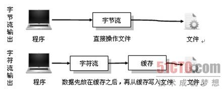

## IO流

### 一、IO流基础

##### 1. 概念

流：代表任何有能力产出数据的数据源对象或者是有能力接受数据的接收端对象<Thinking in Java>

本质：数据的传输，根据数据特性将流抽象为各种类，方便更直观的进行数据操作

作用：为数据源和目的地创建一个输送通道

> 流的概念可以理解为一个输水管道，输入流从管道中取水，输出流向管道内输水。
>
> 字节流和字符流可理解为水滴的大小不同，单位不同

##### 2. IO流分类

> 数据流的方向：从程序运行的内存角度划分
>
> - 输入流 Input
> - 输出流 Output
>
> 
>
> 处理数据单位：
>
> - 字节流 InputStream、outputStream
>
> - 字符流 Reader、Writer
>
>   **字符流的由来：** Java中字符是采用Unicode标准，一个字符是16位，即一个字符使用两个字节来表示。为此，JAVA中引入了处理字符的流。因为数据编码的不同，而有了对字符进行高效操作的流对象。本质其实就是基于字节流读取时，去查了指定的码表。
>
> 功能不同：
>
> - 节点流： 可以从/向一个特定的IO设备（如磁盘，网络）读/写数据的流，也被称为低级流
>
>   
>
> - 处理流：用于对一个已存在的流进行连接和封装，通过封装后的流来实现数据的读/写功能
>
>   好处：可以封装不同的数据源
>
>   

**字节流与字符流区别：**

> 字节流：在操作时本身不会用到缓冲区（内存），是文件本身直接操作
>
> 字符流：在操作时使用了缓冲区，通过缓冲区再操作文件。如果想在不关闭时也可以将字符流的内容全部输出，则可以使用Writer类中的flush()方法完成
>
> 
>
> - 读写单位不同：字节流以字节（8bit）为单位，字符流以字符为单位，根据码表映射字符，一次可能读多个字节
> - 处理对象不同：字节流能处理所有类型的数据（如图片、avi等），而字符流只能处理字符类型的数据
>
> 


| 分类       | 字节输入流               | 字节输出流                | 字符输入流          | 字符输出流          |
| :--------- | :----------------------- | :------------------------ | :------------------ | :------------------ |
| 抽象基类   | InputStream              | OutputStream              | Reader              | Writer              |
| 访问文件   | **FileInputStream**      | **FileOutputStream**      | **FileReader**      | **FileWriter**      |
| 访问数组   | **ByteArrayInputStream** | **ByteArrayOutputStream** | **CharArrayReader** | **CharArrayWriter** |
| 访问管道   | **PipedInputStream**     | **PipedOutputStream**     | **PipedReader**     | **PipedWriter**     |
| 访问字符串 |                          |                           | **StringReader**    | **StringWriter**    |
| 缓冲流     | BufferedInputStream      | BufferedOutputStream      | BufferedReader      | BufferedWriter      |
| 转换流     |                          |                           | InputStreamReader   | OutputStreamWriter  |
| 对象流     | ObjectInputStream        | ObjectOutputStream        |                     |                     |
| 抽象基类   | FilterInputStream        | FilterOutputStream        | FilterReader        | FilterWriter        |
| 打印流     |                          | PrintStream               |                     | PrintWriter         |
| 推回输入流 | PushbackInputStream      |                           | PushbackReader      |                     |
| 特殊流     | DataInputStream          | DataOutputStream          |                     |                     |

> 使用技巧：
>
> 1. 选择输入流还是输出流，如果想从程序写东西至别的地方，就选输出流，反之输入流
> 2. 考虑是字节流还是字符流（每次传1字节还是2字节）如：包含中文选字符流
> 3. 是否需要在处理流中选出一个来增强功能

##### 3. IO流特性

> 1. 先进先出，最先写入输出流的数据最先被输入流读取到
> 2. 顺序存取，可以一个接一个地往流中写入一串字节，读出时也将按写入顺序读取一串字节，不能随机访问中间的数据。（RandomAccessFile**可以从文件的任意位置进行存取（输入输出）操作**）
> 3. 只读或只写，每个流只能是输入流或输出流的一种，不能同时具备两个功能，输入流只能进行读操作，对输出流只能进行写操作。在一个数据传输通道中，如果既要写入数据，又要读取数据，则要分别提供两个流

##### 4. IO中常用的5个类和1接口

> 1.  File（文件特征与管理）：File类是对文件系统中文件以及文件夹进行封装的对象，可以通过对象的思想来操作文件和文件夹。 File类保存文件或目录的各种元数据信息，包括文件名、文件长度、最后修改时间、是否可读、获取当前文件的路径名，判断指定文件是否存在、获得当前目录中的文件列表，创建、删除文件和目录等方法
> 2. InputStream（二进制格式操作）：抽象类，基于字节的输入操作，是所有输入流的父类
> 3. OutputStream（二进制格式操作）：抽象类。基于字节的输出操作。是所有输出流的父类
> 4. Reader（文件格式操作）：抽象类，基于字符的输入操作
> 5. Writer（文件格式操作）：抽象类，基于字符的输出操作
> 6. RandomAccessFile（随机文件操作）：一个独立的类，直接继承至Object.它的功能丰富，可以从文件的任意位置进行存取（输入输出）操作

### 二、IO流对象

##### 1. InputStream


> - **ByteArrayInputStream**：字节数组输入流，该类的功能就是从字节数组(byte[])中进行以字节为单位的读取，也就是将资源文件都以字节的形式存入到该类中的字节数组中去，我们拿也是从这个字节数组中拿
> - **PipedInputStream**：管道字节输入流，它和PipedOutputStream一起使用，能实现**多线程间的管道通信**
> - **FilterInputStream** ：装饰者模式中处于装饰者，具体的装饰者都要继承它，所以在该类的子类下都是用来装饰别的流的，也就是处理类。
> - **BufferedInputStream**：缓冲流，对处理流进行装饰，增强，内部会有一个缓存区，用来存放字节，每次都是将缓存区存满然后发送，而不是一个字节或两个字节这样发送。效率更高
> - **DataInputStream**：数据输入流，它是用来装饰其它输入流，它允许应用程序以与机器无关方式从底层输入流中读取基本 Java 数据类型
> - **FileInputSream**：文件输入流。它通常用于对文件进行读取操作
> - **File**：对指定目录的文件进行操作
> - **ObjectInputStream**：对象输入流，用来提供对“基本数据或对象”的持久存储。也就是能直接传输对象（**反序列化中使用**），

##### 2. OutputStream


> 基本等同于InputStream
>
> 1. OutputStream 是所有的输出字节流的父类，它是一个抽象类。
> 2. ByteArrayOutputStream、FileOutputStream 是两种基本的介质流，它们分别向Byte 数组、和本地文件中写入数据。PipedOutputStream 是向与其它线程共用的管道中写入数据，
> 3. ObjectOutputStream 和所有FilterOutputStream 的子类都是装饰流(序列化中使用)

##### 3. Reader

Reader 中各个类的用途和使用方法基本和InputStream 中的类使用一致。


> 1. **CharReader、StringReader 是两种基本的介质流，它们分别将Char 数组、String中读取数据。**PipedReader 是从与其它线程共用的管道中读取数据
> 2. BufferedReader 很明显就是一个装饰器，它和其子类负责装饰其它Reader 对象。
> 3. FilterReader 是所有自定义具体装饰流的父类，其子类PushbackReader 对Reader 对象进行装饰，会增加一个行号
> 4. InputStreamReader 是一个连接字节流和字符流的桥梁，它将字节流转变为字符流。FileReader 可以说是一个达到此功能、常用的工具类，在其源代码中明显使用了将FileInputStream 转变为Reader 的方法。我们可以从这个类中得到一定的技巧。

##### 4.  Writer


> 1. CharArrayWriter、StringWriter 是两种基本的介质流，它们分别向Char 数组、String 中写入数据。PipedWriter 是向与其它线程共用的管道中写入数据，
> 2. BufferedWriter 是一个装饰器为Writer 提供缓冲功能。
> 3. PrintWriter 和PrintStream 极其类似，功能和使用也非常相似。
> 4. OutputStreamWriter 是OutputStream 到Writer 转换的桥梁，它的子类FileWriter 其实就是一个实现此功能的具体类（具体可以研究一SourceCode）。功能和使用和OutputStream 极其类似，后面会有它们的对应图。

##### 5. 字节流和字符流使用情况

- 字节流：一般用来处理图像，视频，以及PPT，Word类型的文件
- 字符流：一般用于处理纯文本类型的文件（TXT文件等），不能处理图像视频等文件

**结论：只要是处理纯文本数据，就优先考虑使用字符流。除此之外都使用字节流。**

##### 6. 字节流字符流转换

> **使用场景**：
>
> - 字节和字符之间有转换动作时
> - 流操作需要编码或解码时
>
> eg：文本文件在硬盘中以字节流的形式存储时，通过InputStreamReader读取后转化为字符流给程序处理，程序处理的字符流通过OutputStreamWriter转换为字节流保存
>
> **转换流特点：**字符流和字节流间的桥梁、可对读取到的数据经过指定编码转换成字符/字节
>
> **具体对象：**
>
> - InputStreamReader 字节---》字符  将字节流以字符流输入
> - OutputStreamWriter 字符--》字节   将字节流以字符流输出
>
> 实际上是通过byte[]和String来关联。在实际开发中出现的汉字问题实际上都是在字符流和字节流之间转化不统一而造成的
>
> 

##### 7. 处理流BufferedReader，BufferedWriter，BufferedInputStream，BufferedOutputsStream

处理流是在节点流的基础之上进行的，带有Buffered的流又称为缓冲流，缓冲流处理文件的输入输出的速度是最快的。所以一般缓冲流的使用比较多。

### 三、IO流中的设计模式

装饰者模式：


### 四、基于流操作的序列化

> 将保存在内存中的对象数据转化为二进制数据流进行传输，任何对象都可以序列化
>
> **实现：** 实现java.io.Serializable接口
>
> **作用：**把一个Java对象写入到硬盘或者传输到网路上面的其它计算机，这时我们就需要自己去通过java把相应的对象写成转换成字节流。对于这种通用的操作，我们为什么不使用统一的格式呢？没错，这里就出现了java的序列化的概念。在Java的OutputStream类下面的子类ObjectOutput-Stream类就有对应的WriteObject(Object object) 其中要求对应的object实现了java的序列化的接口。
>
> 在使用tomcat开发JavaEE相关项目的时候，我们关闭tomcat后，相应的session中的对象就存储在了硬盘上，如果我们想要在tomcat重启的时候能够从tomcat上面读取对应session中的内容，那么保存在session中的内容就必须实现相关的序列化操作，还有jdbc加载驱动用的就是反序列化，将字符串变为对象
>
> **transient**：标识一个类某些属性不需要序列化
>
> ```java
> public static void clzssToStream() throws IOException {
>     File file = new File("D:" + File.separator + "book1.txt");
>     OutputStream stream = new FileOutputStream(file);
>     ObjectOutputStream objectOutputStream = new ObjectOutputStream(stream);
>     objectOutputStream.writeObject(new Book("java编程思想",80));
>     objectOutputStream.close();
> }
> 
> public static void streamToClzss() throws IOException, ClassNotFoundException {
>     File file = new File("D:" + File.separator + "book1.txt");
>     InputStream inputStream = new FileInputStream(file);
>     ObjectInput objectInput = new ObjectInputStream(inputStream);
> 
>     Book o = (Book) objectInput.readObject();
>     objectInput.close();
>     inputStream.close();
>     System.out.println(o);
> 
> }
> ```
>
> 