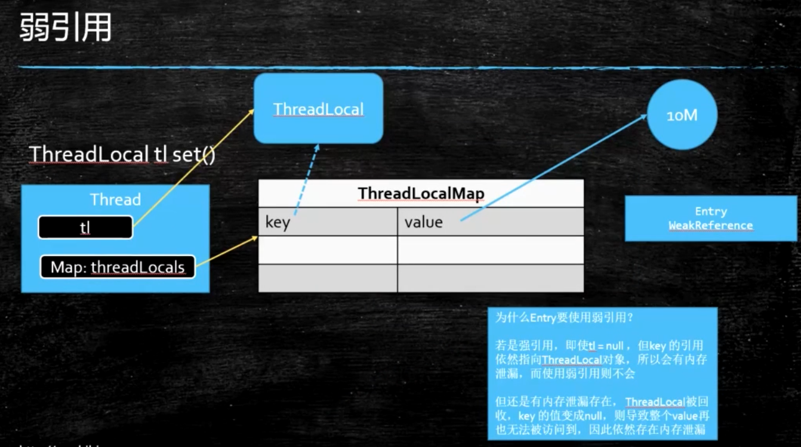
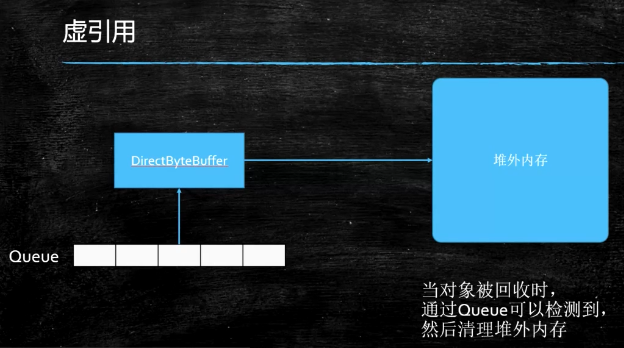

## Java强软弱虚四种引用

java的内存分配和回收都又JVM负责，一个对象是否能被回收，主要看是否有引用指向此对象----可达性分析

java中设计4种引用的目的：

> 1、程序员可以通过代码的方式来决定对象的生命周期；
> 		2、有利用垃圾回收

#### 一、强引用

> 最普遍的一种引用
>
> **特点**：只要某个对象有强引用关联，这个对象就永远不会被回收，即使内存不足抛出OOM错误。
>
> ```java
> M m = new M();
> ```
>
> **回收**：强引用和对象之间的联系被中断 --- >  m = null;
>
> 可以通过重写对象的finalize方法观察到对象的回收时机，实际开发中千万不用重写finalize方法

#### 二、软引用

> 创建：将对象用SoftReference包裹一层，获取对象时只要get即可。
>
> 特点：当内存不足，会触发JVM的GC，如果GC后，内存还是不足，就会把软引用的包裹的对象给干掉，也就是只有在内存不足，JVM才会回收该对象。
>
> ```java
> SoftReference<byte[]> s = new SoftReference<>(new byte[1024102410]);
> System.out.println(s.get());
> ```
>
> 用途：适用于做缓存


#### 三、弱引用



> **创建**：与软引用类似，关键字变成了WeakReference
>
> ```java
> WeakReference<M> m = new WeakReference<>(new M());
> ```
>
> **特点**：不管内存是否足够，只要发生GC，都会被回收
>
> **用途**：ThreadLocal防止内存泄露、WeakHashMap

扩展：ThreadLocal

		Thread中存在成员变量ThreadLocals 
		ThreadLocal中set方法是将当前ThreadLocal对象作为Key，set值作为value放入当前线程的ThreadLocals成员变量中
		当ThreadLocal不用时一定要remove，否则可能会内存泄露
	
		应用：spring中@transactional 中连接池是从ThreadLocal中获得的


#### 四、虚引用




> 创建：创建时传入对象和一个队列
>
> ```java
> private static final ReferenceQueue<M> QUEUE = new ReferenceQueue<>();
> PhantomReference<M> phantomReference = new PhantomReference<>(new M(), QUEUE);
> ```
>
> 特点：无法通过虚引用来获取对一个对象的真实引用。
>
> ​	  虚引用必须与ReferenceQueue一起使用，当GC准备回收一个对象，如果发现它还有虚引用，就会在回收之前，把这个虚引用加入到与之关联的ReferenceQueue中
>
> 应用：管理堆外内存，NIO（ZeroCopy）


​	
