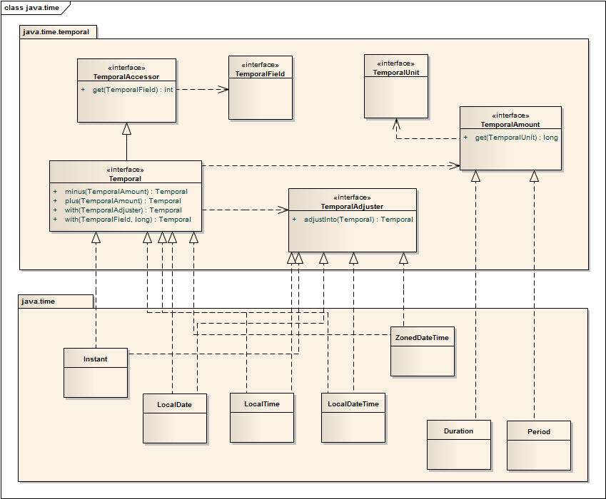

## Java时间相关

### 一、Java 8 以前日期API相关问题

Java 8 以前，java.util.Date，java.util.Calendar，java.util.GregoiranCalendar，java.text.SimpleDateFormat这四个类分别用于处理日期、日历、公历、时间格式化

缺点：

- 非线程安全：存在并发问题
- 设计不佳：date缺少直接操作日期的相关方法，日期和日期格式化分布在多个包中
- 时区处理困难
- 其他：Calendar类月份从零计算问题

Java 8 重新设计了所有日期时间、日历及相关时区的API，统一放置在java.time包下，并作出如下改进

- 线程安全：不仅没有setter方法，并且任何实例的变更都返回新的实例，保证原来的实例不变
- 提供大量用于修改日期时间各个部分的方法，并返回新的实例
- 时区方面引入域（domain）概念
- 借鉴了第三方日期库joda的很多优点

### 二、时间和时区

##### 1. GMT和UTC

GMT：格林尼治标准时间，也就是世界时。GMT的正午是指当太阳横穿格林尼治子午线（本初子午线）时的时间。但由于地球自转不均匀不规则，导致GMT不精确，现在已经不再作为世界标准时间使用

UTC：协调世界时。是经过平均太阳时(以格林威治时间 GMT 为准)、地轴运动修正后的新时标，以「秒」为单位的国际原子时所综合精算而成的时间。为确保UTC与GMT相差不会超过0.9秒，在有需要的情况下（例如 `1998-12-31T23:59:60Z`）会在UTC内加上正或负闰秒。协调世界时区会使用 “Z” 来表示，协调世界时也会被称为 “Zulu time”。UTC现在作为世界标准时间使用。

即：UTC与GMT基本上等同，误差不超过0.9秒。不过日常使用中，GMT 与 UTC 的功能与精确度是没有差别的。

##### 2. 时区

时区作为地理概念，表示 “遵守统一时间标准的一个地区”。

使用与 UTC 的偏移来表示时区，例如：中国所在时区为 UTC+08:00（又称为 Chinese Standard Time，即 “中国标准时间”）

地球自西向东旋转，东边比西边先看到太阳，东边的时间也比西边的早。为了统一世界的时间，1884年的国际经度会议规规定将全球划分为24个时区（东、西各12个时区）。规定英国（格林尼治天文台旧址）为零时区（基准 UTC），东1-12区，西1-12区，中国北京处于东8区（UTC+08:00），那么我们的时间会领先基准-也就是我们在早上 9 点时，伦敦是早上 1 点。

##### 3. Unix时间戳

自 `1970-01-01T00:00:00Z`（Z 即表示 UTC 时间）至今的毫秒差作为表示时间的数值，并且移除期间的“闰秒”（例如 `1998-12-31T23:59:60Z`），这么做当然是为了简化计算机对时间操作的复杂度。Unix 时间体系中，每天固定 86400 秒。

##### 4. Java中的Unix时间

Java 确保：每天 24 小时、每小时 60 分、每分钟 60 秒。

Java 中获取 “当前” 时间的方法，其底层实现，全部由 java.lang.System.currentTimeMillis() 提供自 UTC 1970-01-01T00:00:00 的毫秒数。java.lang.System.currentTimeMillis() 作为 native 方法，其实现与 JVM 所在的机器相关（通常使用 NTP 协议保持更新）。

### 三、Java8相关类

##### 1. LocalDate、LocalTime、LocalDateTime

不包含时区信息，与Instant转换时必须提供时区信息

获取对象方法：

- 静态方法：now()、of()

获取相关参数方法：

- getYear()：获取年
  getHour()：获取小时
  getMinute()：获取分钟
  getSecond()：获取秒值
  getDayOfMonth()：获得月份天数(1-31)
  getDayOfYear()：获得年份天数(1-366)
  getDayOfWeek()：获得星期几(返回一个 DayOfWeek枚举值)
  getMonth()：获得月份(返回一个 Month 枚举值)
  getMonthValue()：获得月份(1-12)
  getYear()：获得年份

判断相关方法：

- isAfter()：判断一个日期**是否在指定日期之后**
- isBefore()：判断一个日期**是否在指定日期之前**
- isEqual()：判断两个日期**是否相同**
- isLeapYear()：判断**是否是闰年**（注意是**LocalDate类**特有的方法）

增加相关的方法

- plusYears(int offset)：增加指定年份
  plusMonths(int offset)：增加指定月份
  plusWeeks(int offset)：增加指定周
  plusDates(int offset)：增加指定日
  plusHours(int offset)：增加指定时
  plusMinuets(int offset)：增加指定分
  plusSeconds(int offset)：增加指定秒
  plusNanos(int offset)：增加指定纳秒

减少相关方法：

- minusYears(int offset)：减少指定年
  minusMonths(int offset)：减少指定月
  minusWeeks(int offset)：减少指定周
  minusDates(int offset)：减少指定日
  minusHours(int offset)：减少指定时
  minusMinuets(int offset)：减少指定分
  minusSeconds(int offset)：减少指定秒
  minusNanos(int offset)：减少指定纳秒

指定年月日方法：

- with(TemporalAdjuster adjuster):指定特殊时间
- withYear(int year):指定年
- withDayOfYear(int dayOfYear):指定日
- withMonth(int month):指定月
- withDayOfMonth(int dayOfMonth):指定日

字符串相关方法

- format() 格式化字符串
- paser(String str)：将一个日期字符串解析成日期对象,注意字符串日期的写法的格式要正确,否则解析失败
- paser(String str, DateTimeFormatter formatter)：将字符串按照参数传入的格式进行解析


##### 2. TemporalAdjuster 时间调节器

前面看到的所有日期操作都是相对比较直接的。有的时候，你需要进行一些更加灵活复杂的操作，比如，将日期调整到下个周日、下个工作日，或者是本月的最后一天。这时，就需要时间调节器 TemporalAdjuster，可以更加灵活地处理日期。


##### 3. Duration 计算两个“时间”间隔类

Duration 表示一个时间段，Duration 包含两部分：seconds 表示秒，nanos 表示纳秒，它们的组合表达了时间长度。

**注意，Duration 不包含毫秒这个属性。**

`Duration`只能处理两个`LocalTime`, `LocalDateTime`, `ZonedDateTime`; 如果传入的是`LocalDate`，将会抛出异常

常用API：

- 静态方法 between()：计算两个时间的间隔，默认是秒
- toDays()：将时间转换为以天为单位的
- toHours()：将时间转换为以时为单位的
- toMinutes()：将时间转换为以分钟为单位的
- toMillis()：将时间转换为以毫秒为单位的
- toNanos()：将时间转换为以纳秒为单位的
  

##### 4. Period 计算两个日期间隔类

Period 在概念上和 Duration 类似，区别在于 Period 是以年月日来衡量一个时间段。Duration 用于计算两个时间间隔，Period 用于计算两个日期间隔，所以 between() 方法只能接收 LocalDate 类型的参数。

- **静态方法 between()**：计算两个**日期之间的间隔**
- getYears()：获取年份
- getMonths()：获取月份
- getDays()：获取天数


##### 5. Instant 时间戳类

`java.time.Instant` 时间线上的一个瞬时点，承载纳秒级精度的 Unix 时间戳，其 `String toString()` 方法基于 ISO-8601 进行格式化。`Instant` 不承载时区信息。

- 获取对象的方法：now()：注意默认获取出来的是默认英国伦敦时区，和我们相差八个小时
- 设置偏移量的方法：atOffset()
- 获取系统默认时区时间的方法：atZone()：方法的参数是要一个时区的编号(可以通过时区编号类获取ZonedDateTime类的对象)

get系列的方法

- getEpochSecond()：获取从1970-01-01 00:00:00到当前时间的秒值
- toEpochMilli()：获取从1970-01-01 00:00:00到当前时间的毫秒值
- getNano()：把获取到的当前时间的秒数 换算成纳秒

ofEpoch系列方法

- ofEpochSecond()：给计算机元年增加秒数
- ofEpochMilli()：给计算机元年增加毫秒数

##### 6. Clock 时钟系统

Clock 是时钟系统，用于查找当前时刻。你可以用它来获取某个时区下当前的日期或者时间。可以用 Clock 来替代旧的 System.currentTimeInMillis() 与 TimeZone.getDefault() 方法。

##### 7. ZonedDate、ZonedTime、ZonedDateTime  带时区的日期时间

三个类方法及用法和 LocalDate、 LocalTime、 LocalDateTime 基本一样，只不过ZonedDate、ZonedTime、ZonedDateTime 这三个**带有特定时区**

##### 8. ZoneId  世界时区类

Java 使用 ZoneId 来标识不同的时区。时区从基准 UTC 开始的一个固定偏移。ZoneId 的子类 ZoneOffset，代表了这种从伦敦格林威治零度子午线开始的时间偏移，也就是时差。

常用API：

- getAvailableZoneIds()：获取世界各个地方的时区的集合
- systemDefault()：获取系统默认时区的ID
- of(String zoneName)：根据各个地区的时区ID名创建对象

##### 9. DateTimeFormatter 用于解析日期字符串和格式化日期输出

DateTimeFormatter用于解析日期字符串和格式化日期输出，创建格式化器最简单的方法是通过 DateTimeFormatter 的静态工厂方法以及常量。

常用API：

- ofPattern(“yyyy-MM-dd”)：静态方法，通过给定格式获取对象
- format()：把一个日期对象的**默认格式** 格式化成**指定的格式**的**字符串**

**格式化输出**&**字符串解析**

java.time.format.DateTimeFormatter 能够进行 TemporalAccessor 类型（包括：LocalDate、LocalTime、LocalDateTime、ZonedDateTime）的格式化输出。同时，LocalDate、LocalTime、LocalDateTime、ZonedDateTime 提供了静态的 parse 方法，能够进行字符串解析


### 四、Date类相关转换问题

##### 1. 与Instant相互转换

```java
    Date date = Date.from(instant);
    Instant instant2 = date.toInstant();
```

##### 2. 与LocalDateTime相互转换

```java
LocalDateTime localDateTime1 = date.toInstant().atZone(ZoneId.systemDefault()).toLocalDateTime();
```

##### 3. 与LocalDateTime相互转换

##### 4. 与LocalDate相互转换

##### 5. 与LocalTime相互转换


##### 6. SimpleDateFormat 格式化 使用方法：

```java
/* 1.在需要执行格式化的地方都新建SimpleDateFormat实例，使用局部变量来存放SimpleDateFormat实例
		缺点：可能会导致短期内创建大量的SimpleDateFormat实例
*/
public static String formatDate(Date date) {
    SimpleDateFormat sdf = new SimpleDateFormat("yyyy-MM-dd HH:mm:ss");
    return sdf.format(date);
}

/* 2.把SimpleDateFormat实例设为静态成员变量，共享SimpleDateFormat对象
		缺点：需要对SimpleDateFormat添加同步
*/
private static SimpleDateFormat sdf = new SimpleDateFormat("yyyy-MM-dd HH:mm:ss");
public static String formatDate(Date date) {
    synchronized (sdf) {
        return sdf.format(date);
    }
}
/* 3.使用ThreadLocal来限制SimpleDateFormat只能在线程内共享，这样就避免了多线程导致的线程安全问题		
*/
private static ThreadLocal<DateFormat> threadLocal = new ThreadLocal<DateFormat>() {
    @Override
    protected DateFormat initialValue() {
        return new SimpleDateFormat("yyyy-MM-dd HH:mm:ss");
    }
};
public static String formatDate(Date date) {
    return threadLocal.get().format(date);
}
```


### 五、java.time类图




类图所示，java.time.temporal 提供的接口：

- TemporalField：日期与时间 “字段”，例如：2017-11-18 中的 18 “天”
- TemporalUnit：时间 “单位”，例如：1 年 13 天的 13 “天”
- TemporalAccessor：“时间相关” 对象的 “只读” 接口
- Temporal：“时间相关” 对象的 “读写” 接口，继承自 TemporalAccessor
- TemporalAdjuster：Temporal 类型对象 “设置 & 调整” 的函数式接口
- TemporalAmount：时间段
- java.time 提供的类：

Instant、LocalDate、LocalTime、LocalDateTime、ZonedDateTime：实现 Temporal 与 TemporalAdjuster 接口
Duration、Period：实现 TemporalAmount 接口

### 六、总结

##### 1.Java 8时间日期 API 中的设计模式

> - 工厂模式：now()、of() 等工厂方法直接生成日期或者日期时间。
> - 策略模式：LocalDate/LocalTime/LocalDateTime/ZonedDateTime，针对日期、时间、日期和时间、带时区的日期时间，使用具体的时间日期类处理。策略模式在设计一整套东西时，对开发者特别友好。前面也提到，所有新的日期时间 API 类都实现了一系列方法用以完成通用的任务，如：加、减、格式化、解析、从日期/时间中提取单独部分。一旦你使用了其中某个类的方法，那么非常容易上手其他类的使用。
> - 构建者模式：Java 8 开始在 Calendar 中加入了构建者类，可以按如下方式生成新的 Calendar 对象。

这里设计模式与标准的教科书式的设计模式可能有所区别，所以我们在使用设计模式时也应灵活处理，不是一成不变的。

##### 2. Java 8的日期时间API总结

新的时间与日期 API 中很重要的一点是，它定义清楚了基本的时间与日期的概念，比方说日期、时间、瞬时时间、持续时间、时区及时间段。它们都是基于 ISO8601 日历系统，它是世界民用历法，也就是我们所说的公历。

java.time包下主要包含下面几个主要的类：

> LocalDate：表示不带时间的日期，比如：2016-10-20
> LocalTime：表示不带日期的时间，比如：23:12:10
> LocalDateTime：日期时间，比如：2016-10-20 23:14:21
> TemporalAdjuster : 时间调节器
> TemporalAdjusters：获得指定日期时间等，如当月的第一天、今年的最后一天等
> Duration：持续时间，计算两个“时间”的间隔
> Period：日期间隔，计算两个“日期”的间隔
> Instant：Unix 时间，它代表的是时间戳，比如 2018-01-14T02:20:13.592Z
> Clock：时钟，获取某个时区下的瞬时时间
> ZoneId：时区id，例如 Asia/Shanghai等
> ZonedDateTime：带时区的日期时间
> DateTimeFormatter：时间格式化

新的 API 区分各种日期时间概念并且各个概念使用相似的方法定义模式，这种相似性非常有利于 API 的学习。总结一下一般的方法规律：

> of：静态工厂方法，用于创建实例
> now：静态工厂方法，用当前时间创建实例
> parse：静态工厂方法，从字符串解析得到对象实例
> get：获取对象的部分状态
> is：检查某些东西的是否是 true，例如比较时间前后
> with：返回一个部分状态改变了的时间日期对象拷贝(单独一个with方法,参数为TemporalAdjusters类型)
> plus：返回一个时间增加了的时间日期对象拷贝
> minus：返回一个时间减少了的时间日期对象拷贝
> to：把当前时间日期对象转换成另外一个，可能会损失部分状态。
> at：把这个对象与另一个对象组合起来，例如：date.atTime(time)
> format：将时间日期格式化为字符串
> 最后再次声明，Java 8 中新的时间与日期 API 中的所有类都是不可变且线程安全的，任何修改操作都会返回一个新的实例，而之前 java.util.Date、Calendar 以及 SimpleDateFormat 这些关键的类都不是线程安全的。
>


